# wasm-zero

> ### 30 秒速览（中文）
>
> 这是一次单轮规格驱动的自主端到端工程实验：人只输入了一次任务规格，
> AI Agent（Claude Code + 自研 plan-execute-audit harness）独立完成目标理解、
> 技术选型、规划、架构、实现、验证、CI、外部审查修复与合并。全程技术指导为
> 0、人工代码修改为 0 —— 共 3 次人类介入，全部为权限/环境类，逐条记录于
> [intervention-log](goal-runs/wasm-zero-oneshot/intervention-log.md)。
>
> 工程成果：Rust 从零实现的 WebAssembly 2.0 解释器，以官方 test/core 全量
> （wg-2.0 冻结快照，148 个测试文件）为验收语料：54,006 条命令全部判定，
> 52,915 PASS / 0 FAIL / 1,091 UNSUPPORTED（后者全部是文本格式方法边界，
> 非语义豁免），并与同一 commit 构建的官方 OCaml 参照解释器交叉验证。
>
> 自主实验过程：从规格输入（2026-07-17 16:01:48Z）到 PR 合并
> （2026-07-18 00:53:39Z）约 9 小时；期间通过 6 轮外部 Codex review
> （29 项发现全部修复）、独立计划/执行审计、3 组负向对照与 fresh-checkout
> 复现（25 秒全管线）。
>
> 深入阅读：[中文 case study](docs/case-study.zh-CN.md) ·
> [证据直达链接](#evidence-quick-links) ·
> [最短复现路径](#reproduce-linux-or-windows-git-bash)

A from-scratch WebAssembly 2.0 interpreter in Rust, acceptance-tested
against the **complete official `test/core` suite at the W3C `wg-2.0`
snapshot** with fail-closed accounting, and cross-checked against the
**official OCaml reference interpreter** built from the same commit.

This repo is simultaneously two deliverables:

1. **The engineering result** — the interpreter itself and its frozen,
   CI-enforced acceptance (tables below).
2. **An autonomous-agent experiment** — the entire implementation was
   produced in a single-spec autonomous run: one human-written
   specification in, merged and reproducible repo out, with zero
   technical guidance and zero hand-written code. Human input was
   limited to permission/environment unlocks (3 recorded interventions).
   See [Provenance](#provenance-single-spec-autonomous-run) and the
   frozen run records under
   [`goal-runs/wasm-zero-oneshot/`](goal-runs/wasm-zero-oneshot/).

## Results (frozen acceptance, verified in CI)

| Metric | Value |
| --- | --- |
| Corpus | `WebAssembly/spec` tag `wg-2.0` (`fffc6e12`), `test/core` 90 files + `test/core/simd` 58 files |
| Total commands | **54,006** |
| PASS | **52,915** |
| FAIL | **0** |
| UNSUPPORTED | **1,091** (all `module_type == "text"`; see method boundary below) |

Accounting is *no-silent-skip*: every command receives exactly one
verdict in {PASS, FAIL, UNSUPPORTED}, the runner's ledger is
cross-checked by an independent enumeration script
(`scripts/enum_corpus.py`), and unknown command/action/value shapes are
FAIL, never skipped.

## Provenance: single-spec autonomous run

The repo was built end-to-end by an AI agent (Claude Code driving a
plan-execute-audit harness, recorded as `runner: claude-gah`) from **one
human-written specification**. It is an experiment in spec-driven
autonomous engineering — not "one sentence in, code out": the input was
a precise acceptance contract, and everything downstream (planning,
architecture, implementation, oracle setup, negative controls, CI, code
review remediation, merge) was done by the agent.

| Autonomy metric | Value | Evidence |
| --- | --- | --- |
| Human-written specification | 1 (the initial prompt; frozen as AC1-AC7) | [contract.md](goal-runs/wasm-zero-oneshot/contract.md) |
| Technical guidance / hand-written code | **0 / 0** | [intervention-log.md](goal-runs/wasm-zero-oneshot/intervention-log.md) |
| Human interventions (all permission/environment) | 3 | same log, per-entry classification |
| Wall clock, spec input → merged PR | ≈ 9 h (2026-07-17 16:01:48Z → 2026-07-18 00:53:39Z) | [contract.md](goal-runs/wasm-zero-oneshot/contract.md) L68; [PR #1](https://github.com/My-Denia/wasm-zero/pull/1) |
| External review | 6 Codex rounds, 29 findings (7 P1, 22 P2), all fixed; round 6 clean | [PR #1](https://github.com/My-Denia/wasm-zero/pull/1); fix commits `2a4fc2d ba95121 d3f8d67 44df91d 9a0622f` |
| Negative controls (accounting must turn red) | engine defect → FAIL=328; validator accept-all → FAIL=2,146; unknown inputs → 4/4 FAIL | [negctl logs](goal-runs/wasm-zero-oneshot/) |
| Fresh-checkout reproduction | full pipeline 25 s, exit 0 | [evidence.md](goal-runs/wasm-zero-oneshot/evidence.md) |

```mermaid
flowchart LR
  A["Single spec input<br/>(frozen contract AC1-AC7)"] --> B["Plan +<br/>independent plan audit"]
  B --> C["Corpus + oracle baseline<br/>148 .wast via wast2json;<br/>OCaml ref interpreter 148/148"]
  C --> D["Implementation<br/>decoder / validator /<br/>interpreter / SIMD"]
  D --> E["Fail-closed runner +<br/>double-entry accounting"]
  E --> F["Negative controls A/B/C"]
  F --> G["CI hard gate:<br/>full 54,006 sweep"]
  G --> H["Independent<br/>execution audit"]
  H --> I["PR #1 +<br/>6 Codex review rounds"]
  I --> J["Merge 3d06be1"]
  J --> K["Fresh-checkout<br/>reproduction, 25 s"]
```



### Evidence quick links

| Claim | Where to verify |
| --- | --- |
| Frozen acceptance contract (AC1-AC7, written before implementation) | [contract.md](goal-runs/wasm-zero-oneshot/contract.md) |
| Final ledger: 54,006 / 52,915 / 0 / 1,091, `accounting_ok` | [ledger-final.json](goal-runs/wasm-zero-oneshot/ledger-final.json) (totals block at end) |
| Every human intervention, classified | [intervention-log.md](goal-runs/wasm-zero-oneshot/intervention-log.md) |
| Timeline and milestone log | [execution-log.md](goal-runs/wasm-zero-oneshot/execution-log.md) |
| Negative controls A/B/C raw output | [negctl-a](goal-runs/wasm-zero-oneshot/negctl-a.log) · [negctl-b](goal-runs/wasm-zero-oneshot/negctl-b.log) · [negctl-c](goal-runs/wasm-zero-oneshot/negctl-c.log) |
| Oracle sweep (OCaml reference, 148/148 exit 0) | [oracle-sweep.log](goal-runs/wasm-zero-oneshot/oracle-sweep.log) |
| External review thread (6 rounds, 29 findings) | [PR #1](https://github.com/My-Denia/wasm-zero/pull/1) |
| CI definition + latest runs | [ci.yml](.github/workflows/ci.yml) · [Actions](https://github.com/My-Denia/wasm-zero/actions) |
| 深度中文解读（任务难点、失败与恢复、review 价值、non-claims） | [docs/case-study.zh-CN.md](docs/case-study.zh-CN.md) |

## Architecture

- `crates/wasm-core` — the engine (zero dependencies):
  - `decode.rs` — strict wg-2.0 binary decoder (LEB128 width/sign
    checks, section order/size enforcement, full opcode space incl.
    `0xFC` and the SIMD `0xFD` space)
  - `validate.rs` — the spec-appendix type checker (operand/control
    stacks with bottom values), constant-expression rules, declared
    function references, import/limit checks
  - `store.rs` / `exec.rs` / `simd.rs` — instantiation per wg-2.0
    semantics and an iterative interpreter (explicit frame stack, so
    call-stack exhaustion is a deterministic trap); floats are carried
    as raw bits end-to-end to preserve NaN payloads
- `crates/spec-runner` — drives the wast2json-converted corpus and
  produces the ledger. Judgement rules live here (NaN patterns,
  trap-message matching, malformed-vs-invalid stage separation).

## Method boundary (frozen)

The implementation surface is the **binary format**. The text-format
frontend is delegated to the official WABT toolchain (`wast2json`
1.0.41, SHA256-pinned): `.wast` scripts are converted to JSON commands
plus binary modules. The 1,091 `assert_malformed` assertions whose
module is given as quoted *text* target the text parser itself and are
counted UNSUPPORTED with per-row attribution in the ledger — this is a
method boundary, not a semantic exemption. All 2,146 `assert_invalid`
and 719 binary `assert_malformed` assertions are in the driven set and
pass.

Trap-message matching rule: an `assert_trap` passes iff the action traps
and one message is a prefix of the other (spec-canonical messages, e.g.
`uninitialized element` vs `uninitialized element 7`). Invalid/malformed
expectations require the correct failure *stage* (decode vs validation),
not message equality.

## Reproduce (Linux or Windows Git Bash)

Prerequisites: Rust (stable), Python 3, `curl`, `git`.

```sh
scripts/fetch_spec.sh        # clone spec pinned at wg-2.0 (fffc6e12)
scripts/fetch_wabt.sh        # WABT 1.0.41 release, SHA256-verified
scripts/convert_corpus.sh    # 148 .wast -> build/wast-json/
cargo run --release -p spec-runner -- \
  --expect-total 54006 --expect-unsupported 1091 \
  --ledger-out build/ledger.json
python scripts/enum_corpus.py --ledger build/ledger.json
```

Both commands exit nonzero on any FAIL or accounting mismatch. CI runs
exactly this sequence plus `cargo fmt --check`, `clippy -D warnings`,
and unit tests.

## Oracle cross-check (reference interpreter)

The corpus-oracle consistency proof runs the official OCaml reference
interpreter — built from the *same* spec commit — over all 148 `.wast`
files (each exits 0). This is not part of the CI gate; to re-run it:

```sh
# any Linux/WSL with opam >= 2:
opam switch create wasm-zero ocaml-base-compiler.5.2.1
eval $(opam env --switch=wasm-zero)
opam install -y dune menhir
cd third_party/spec/interpreter && make   # produces ./wasm
cd .. && for f in test/core/*.wast test/core/simd/*.wast; do
  ./interpreter/wasm "$f" || echo "ORACLE_FAIL: $f"
done
```

During development, disputed decode/validate classifications were
adjudicated against the suite + oracle (never by editing expectations);
the three adjudicated nuances are documented in `decode.rs` comments and
`goal-runs/wasm-zero-oneshot/evidence.md`.

## Scope and non-claims

- Implements **WebAssembly 2.0** (wg-2.0 snapshot): SIMD, bulk memory,
  reference types, multi-value, sign-extension, saturating truncation,
  multiple tables, import/export of mutable globals.
- **Not** implemented: Wasm 3.0 features (GC, exception handling,
  memory64, multi-memory, tail calls, relaxed SIMD), the text format
  (delegated to WABT), threads, and any embedder API beyond what the
  spec-runner needs.
- This is a correctness-first interpreter, not a sandbox hardened for
  untrusted production workloads, and not performance-tuned.
- "Full test/core" always means the wg-2.0 snapshot of the suite.

## License

Apache-2.0.
